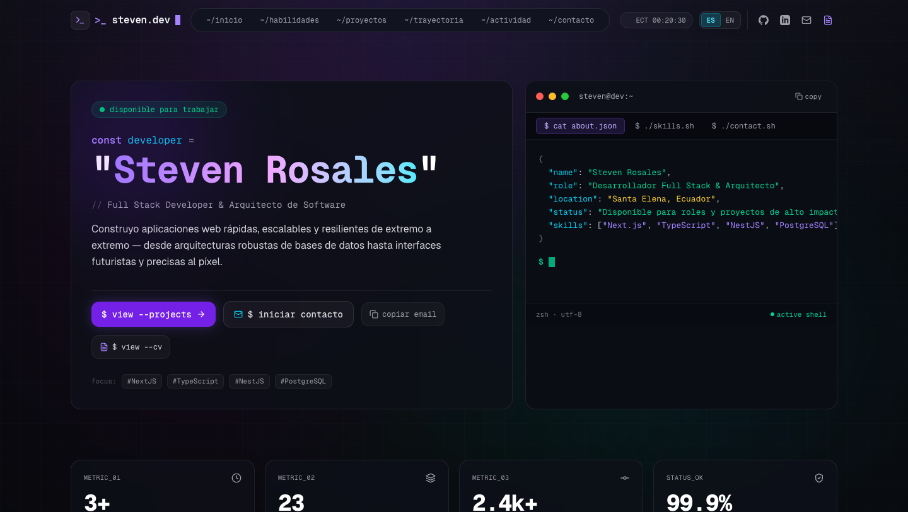

# Steven Rosales — Full Stack Developer & Software Architect

<div align="center">

[](https://stevenrocaiche.space)
[](https://nextjs.org/)
[](https://react.dev/)
[](https://www.typescriptlang.org/)
[](https://tailwindcss.com/)
[](LICENSE)

<br />

**A cutting-edge, cyber-minimalist developer portfolio crafted with Next.js 16, React 19, and Tailwind CSS.**  
*Engineered with a Bento Grid layout, real-time GitHub telemetry, interactive terminal HUD, and bilingual internationalization.*

<br />

<a href="https://stevenrocaiche.space">
  
</a>

</div>

---

## ⚡ Highlights & Features

- **Cyber-Minimalist Bento Grid UI:** Modular layout designed with custom glowing spotlight card effects, radial mouse tracking, and ultra-crisp dark aesthetic.
- **Interactive Developer Terminal HUD:** Embedded interactive zsh-style terminal interface featuring tabs for biography, skills, and contact telemetry.
- **Live GitHub Telemetry:** Real-time synchronization via Next.js API Routes connecting to the GitHub REST API to display live contribution heatmaps, commit activity, and repository metrics.
- **Full Bilingual i18n Architecture:** Seamless instant switching between Spanish (`es`) and English (`en`), built with React 19's `useSyncExternalStore` for flicker-free client hydration.
- **Dynamic SEO & Metadata:** OpenGraph tags, dynamic Twitter cards, canonical tags, and structured schemas optimized for sub-second Core Web Vitals.
- **Zero-Latency Turbopack Build:** Powered by Next.js 16 and Turbopack for instantaneous hot-module reloading and optimized static asset generation.

---

## 🛠️ Tech Stack & Architecture

| Layer | Technologies |
| :--- | :--- |
| **Framework & Core** | Next.js 16 (App Router), React 19, TypeScript 5 |
| **Styling & HUD** | Tailwind CSS v4, CSS Variables, Lucide Icons, Custom Spotlight Cards |
| **State & i18n** | React `useSyncExternalStore`, Custom Lightweight Dictionary Context |
| **API & Integrations** | Next.js API Routes, GitHub REST API v3, SWR / Server Revalidation |
| **Tooling & Quality** | Turbopack, ESLint (Core Web Vitals + Strict TypeScript), Git |

---

## 📁 Repository Structure

```text
steven-portfolio/
├── docs/
│   └── screenshots/              # High-resolution UI captures
│       └── preview-hero.png      # Hero and terminal HUD preview
├── src/
│   ├── app/                      # Next.js App Router (Layout, Page, APIs)
│   │   ├── api/
│   │   │   └── github/route.ts   # Live GitHub stats and telemetry API
│   │   ├── layout.tsx            # Root layout with fonts, metadata, and providers
│   │   └── page.tsx              # Main portfolio Bento Grid assembly
│   ├── components/               # Bento Grid modular UI components
│   │   ├── ContactBento.tsx      # Terminal-style contact form & quick links
│   │   ├── ExperienceBento.tsx   # Chronological work experience timeline
│   │   ├── GithubHeatmapBento.tsx# Live SVG contribution heatmap & commit feed
│   │   ├── HeroBento.tsx         # Main hero HUD with interactive terminal
│   │   ├── Navbar.tsx            # Fixed glassmorphism navbar with i18n switch
│   │   ├── ProjectsBento.tsx     # Curated showcase with category filters
│   │   ├── SpotlightCard.tsx     # Reusable card with dynamic radial hover glow
│   │   ├── StatsBento.tsx        # Production metrics and repository telemetry
│   │   └── TechStackBento.tsx    # Categorized technical competencies
│   ├── data/                     # Data layers and portfolio configurations
│   │   ├── portfolioData.ts      # Centralized personal info, skills & telemetry
│   │   └── projects.ts           # Curated independent & enterprise projects
│   ├── i18n/                     # Internationalization architecture
│   │   ├── locales/              # Translation dictionaries (es.ts, en.ts)
│   │   ├── LanguageContext.tsx   # Fast client sync provider
│   │   └── types.ts              # Strongly typed dictionary interfaces
│   └── lib/
│       └── utils.ts              # Tailwind clsx/twMerge utilities
├── .env.example                  # Environment variables documentation
└── README.md                     # Project documentation
```

---

## 🚀 Getting Started

### Prerequisites

- **Node.js** >= 18.18.0 (Recommended: v20 LTS or higher)
- **npm**, **pnpm**, or **yarn**

### 1. Clone the repository

```bash
git clone https://github.com/StevenRosalesC/steven-portfolio.git
cd steven-portfolio
```

### 2. Install dependencies

```bash
npm install
```

### 3. Configure environment variables

Copy the example environment file:

```bash
cp .env.example .env.local
```

Adjust the variables in `.env.local` as needed:

```env
# Optional: Increases GitHub API rate limits from 60 to 5,000 req/hr
GITHUB_TOKEN=your_github_personal_access_token

# Optional: Production deployment URL for metadata
NEXT_PUBLIC_SITE_URL=https://stevenrocaiche.space

# Optional: Public contact email address
NEXT_PUBLIC_CONTACT_EMAIL=stevenrosales.dev@gmail.com

# Optional: Direct link to hosted Curriculum Vitae (CV) / Resume
NEXT_PUBLIC_CV_URL=https://drive.google.com/file/d/your-cv-id/view?usp=sharing
```

### 4. Run the development server

```bash
npm run dev
```

Open [http://localhost:3000](http://localhost:3000) in your browser to view the application.

---

## 📦 Build & Production

To create an optimized production build:

```bash
npm run build
npm run start
```

To run lint checks:

```bash
npm run lint
```

---

## 🌐 Deployment

This application is deployed and hosted with continuous integration:

- **Live URL:** [https://stevenrocaiche.space](https://stevenrocaiche.space)

---

## 👤 Author

**Steven Rosales**  
Full Stack Developer & Software Architect — Santa Elena, Ecuador

- **Website:** [stevenrocaiche.space](https://stevenrocaiche.space)
- **GitHub:** [@StevenRosalesC](https://github.com/StevenRosalesC)
- **LinkedIn:** [Steven Rosales](https://www.linkedin.com/in/steven-rosales-dev/)
- **Email:** [stevenrosales31@gmail.com](mailto:stevenrosales31@gmail.com)

---

## 📄 License

This project is open-source and available under the [MIT License](LICENSE).
